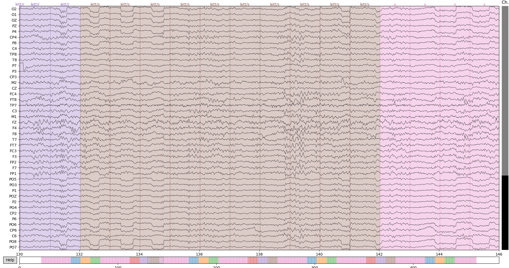
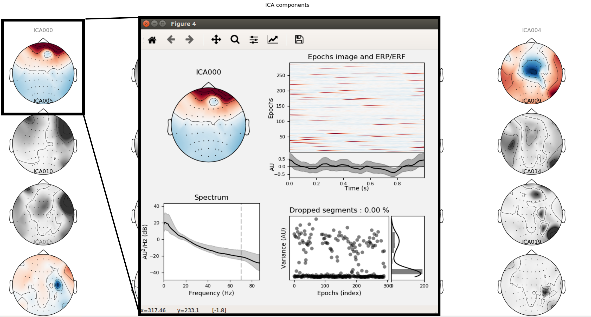

# Python EEG Analysis

This project demonstrates how to work with EEG signal using Python (Jupyter Notebook - [EEG Preprocessing using MNE](./S1_PREPROCESSING.ipynb) ).
It covers basics of cleaning the signal. Note that there is no optimal way to clean the signal, because it depends on the application. However, there are few common steps, present in many preprocessing pipelines:
- plotting multichannel signal to examine it,
- changing of the sampling rate,
- dropping unused channels,
- reading channels spatial location (montage),
- interpolating noisy channels,
- bandpass zero-phase filtering,
- setting and correcting event triggers/markers,
- epoching the data and rejecting bad epochs,
- rereferencing to average,
- rejecting artifacts using Independent Components Analysis,
- saving results.

All of these steps are covered in this project.

## Prerequisites

- install [MNE software for Python](https://mne.tools/stable/install/index.html)
- install [Jupyter Notebook - Getting started with classic Jupyter Notebook](https://jupyter.org/install.html)
- after cloning repository to your local site, uncompress `data.tar.gz` (1.3 GB of data)

## References

For review of EEG signal processing procedures read:
- [1] S. J. Luck, [An introduction to the event-related potential technique](https://mitpress.mit.edu/books/introduction-event-related-potential-technique-second-edition). Cambridge, MA ; London: The Mit Press, 2005.
- [2] M. X. Cohen, [Analyzing neural time series data: theory and practice](https://mitpress.mit.edu/books/analyzing-neural-time-series-data). Cambridge, Massachusetts: The MIT Press, 2014.
- [EEGLAB Tutorial](https://sccn.ucsd.edu/wiki/Getting_Started)
- [MNE Tutorial](https://mne.tools/stable/auto_tutorials/index.html)

